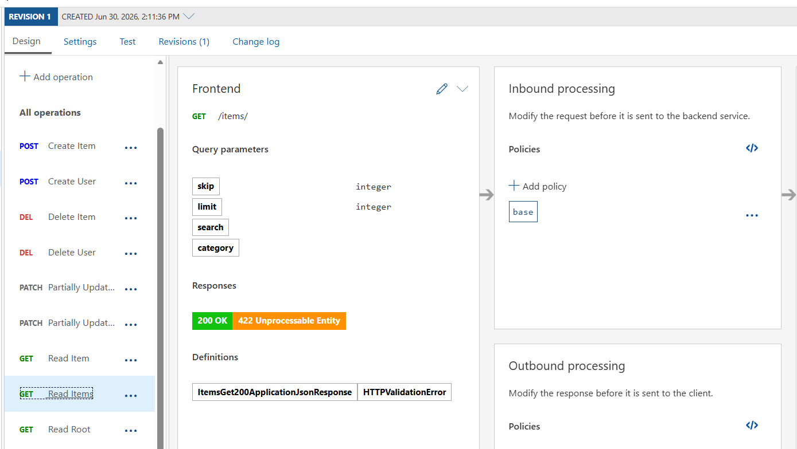

# Setting Query Rate Limits in Azure API Management (APIM)

Rate limiting is a crucial mechanism in Azure API Management (APIM) to protect your backend APIs from excessive requests, prevent abuse, and ensure fair usage among your consumers. 

In APIM, rate limits are configured using **Inbound Policies**. These policies are rules executed on the HTTP request before it reaches your FastAPI backend.

## How to Configure a Rate Limit

You can apply a rate limit to all endpoints globally, or to specific operations (like `GET /items/`).

### 1. Navigate to your API
1. Open the [Azure Portal](https://portal.azure.com) and navigate to your **API Management service**.
2. From the left menu under **APIs**, select your API (e.g., `FastAPI`).

### 2. Select the Scope
Choose where you want to apply the limit:
- **All operations**: Click on "All operations" to apply the limit globally.
- **Specific endpoint**: Click on a specific operation (e.g., `read_items`) to limit only that route.

### 3. Add the Inbound Policy
1. In the **Design** tab, locate the **Inbound processing** section.
2. Click on the **+ Add policy** button.
3. Select **Limit call rate** (or click the `</>` icon to edit the raw XML policy).

### 4. Configure the XML Policy (Example)
When modifying the HTTP request policies via the XML editor, you can use the `<rate-limit>` or `<rate-limit-by-key>` tags. 

Here is an example policy that limits calls to **5 requests per 60 seconds** per subscription:

```xml
<policies>
    <inbound>
        <base />
        <!-- Limit to 5 calls per 60 seconds per subscription -->
        <rate-limit calls="5" renewal-period="60" />
    </inbound>
    <backend>
        <base />
    </backend>
    <outbound>
        <base />
    </outbound>
    <on-error>
        <base />
    </on-error>
</policies>
```

*(Alternatively, you can use `<rate-limit-by-key>` to limit based on the caller's IP address instead of their subscription key).*

### 5. Modifying the HTTP Request (Set Query Parameter)
You can also use Inbound Policies to modify the HTTP request before it reaches your backend. For example, if you want to forcefully set or override a query parameter (like forcing `limit=2`), you can use the `<set-query-parameter>` tag:

```xml
<policies>
    <inbound>
        <base />
        <set-query-parameter name="limit" exists-action="override">
            <value>2</value>
        </set-query-parameter>
    </inbound>
    <backend>
        <base />
    </backend>
    <outbound>
        <base />
    </outbound>
    <on-error>
        <base />
    </on-error>
</policies>
```

### 6. Save and Test
Once saved, any client exceeding the configured rate limit will receive an HTTP `429 Too Many Requests` error response directly from Azure APIM, meaning the excessive requests will never even touch your FastAPI backend! Furthermore, if they do successfully hit your API, their request will be automatically modified by the policies (e.g., the `limit` query string parameter will be set to `2`).

---

## Visual Reference

Below is a reference image demonstrating how the Query Rate Limit is set in the APIM interface:


