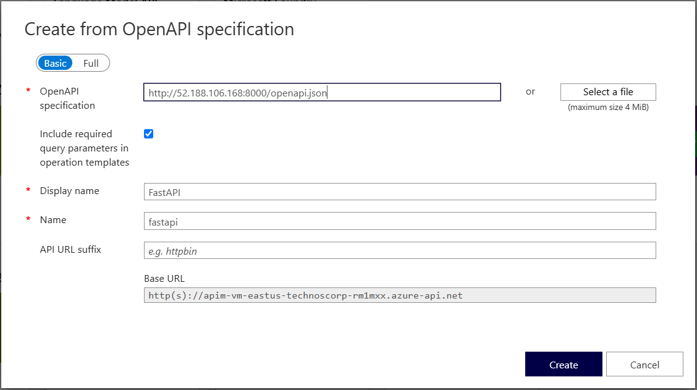

# FastAPI Backend

This is a simple FastAPI application demonstrating basic CRUD operations.

## Running the Application

To run the application locally, you can use Uvicorn. First, make sure you have installed the requirements:

```bash
pip install -r requirements.txt
python -m uvicorn main:app --host 0.0.0.0 --port 8000
```

By default, the application will run at `http://127.0.0.1:8000` (or your VM's public IP).

## Testing with Postman

You can use Postman to test the API endpoints. Below are the instructions and sample requests for each endpoint.

### 1. Root Endpoint (GET)
- **Method:** `GET`
- **URL:** `http://127.0.0.1:8000/`
- **Description:** Returns a greeting message.
- **Expected Response:**
  ```json
  {
      "message": "Hello World"
  }
  ```

### 2. List Items (GET)
- **Method:** `GET`
- **URL:** `http://127.0.0.1:8000/items/?skip=0&limit=5&search=laptop`
- **Description:** Retrieves a list of all items. You can use query parameters like `skip` (pagination), `limit` (max results), and `search` (filter string) by appending them to the URL after a `?`.
- **Expected Response:**
  ```json
  {
      "query_params": {
          "skip": 0,
          "limit": 5,
          "search": "laptop"
      },
      "items": [
          {
              "item_id": 1,
              "name": "Item 1"
          },
          {
              "item_id": 2,
              "name": "Item 2"
          }
      ]
  }
  ```

### 3. Read Item (GET)
- **Method:** `GET`
- **URL:** `http://127.0.0.1:8000/items/1?q=test`
- **Description:** Retrieves an item by its ID. You can also pass an optional query parameter `q`.
- **Expected Response:**
  ```json
  {
      "item_id": 1,
      "q": "test"
  }
  ```

### 4. Create Item (POST)
- **Method:** `POST`
- **URL:** `http://127.0.0.1:8000/items/`
- **Description:** Creates a new item.
- **Body:** Under the Body tab, select **raw** and choose **JSON** format.
  ```json
  {
      "name": "Laptop",
      "description": "A high performance laptop",
      "price": 1500.00,
      "tax": 150.00
  }
  ```
- **Expected Response:**
  ```json
  {
      "message": "Item Laptop created successfully",
      "item": {
          "name": "Laptop",
          "description": "A high performance laptop",
          "price": 1500.0,
          "tax": 150.0
      }
  }
  ```

### 5. Update Item (PUT)
- **Method:** `PUT`
- **URL:** `http://127.0.0.1:8000/items/1`
- **Description:** Updates an existing item.
- **Body:** Under the Body tab, select **raw** and choose **JSON** format.
  ```json
  {
      "name": "Gaming Laptop",
      "description": "Updated description",
      "price": 2000.00,
      "tax": 200.00
  }
  ```
- **Expected Response:**
  ```json
  {
      "message": "Item 1 updated successfully",
      "item_id": 1,
      "item": {
          "name": "Gaming Laptop",
          "description": "Updated description",
          "price": 2000.0,
          "tax": 200.0
      }
  }
  ```

### 6. Partially Update Item (PATCH)
- **Method:** `PATCH`
- **URL:** `http://127.0.0.1:8000/items/1`
- **Description:** Partially updates an existing item.
- **Body:** Under the Body tab, select **raw** and choose **JSON** format.
  ```json
  {
      "price": 1800.00
  }
  ```
- **Expected Response:**
  ```json
  {
      "message": "Item 1 partially updated successfully",
      "item_id": 1,
      "item": {
          "name": null,
          "description": null,
          "price": 1800.0,
          "tax": null
      }
  }
  ```

### 7. Delete Item (DELETE)
- **Method:** `DELETE`
- **URL:** `http://127.0.0.1:8000/items/1`
- **Description:** Deletes an item by its ID.
- **Expected Response:**
  ```json
  {
      "message": "Item 1 deleted successfully",
      "item_id": 1
  }
  ```

### 8. List Users (GET)
- **Method:** `GET`
- **URL:** `http://127.0.0.1:8000/users/?skip=0&limit=10&is_active=true`
- **Description:** Retrieves a list of all users. You can use query parameters like `skip`, `limit`, and `is_active` (boolean flag) to filter the results.
- **Expected Response:**
  ```json
  {
      "query_params": {
          "skip": 0,
          "limit": 10,
          "is_active": true
      },
      "users": [
          {
              "user_id": 1,
              "username": "user1"
          },
          {
              "user_id": 2,
              "username": "user2"
          }
      ]
  }
  ```

### 9. Read User (GET)
- **Method:** `GET`
- **URL:** `http://127.0.0.1:8000/users/1`
- **Description:** Retrieves a user by their ID.
- **Expected Response:**
  ```json
  {
      "user_id": 1,
      "email": "user1@example.com"
  }
  ```

### 10. Create User (POST)
- **Method:** `POST`
- **URL:** `http://127.0.0.1:8000/users/`
- **Description:** Creates a new user.
- **Body:** Under the Body tab, select **raw** and choose **JSON** format.
  ```json
  {
      "username": "johndoe",
      "email": "john@example.com",
      "full_name": "John Doe",
      "disabled": false
  }
  ```
- **Expected Response:**
  ```json
  {
      "message": "User johndoe created successfully",
      "user": {
          "username": "johndoe",
          "email": "john@example.com",
          "full_name": "John Doe",
          "disabled": false
      }
  }
  ```

### 11. Update User (PUT)
- **Method:** `PUT`
- **URL:** `http://127.0.0.1:8000/users/1`
- **Description:** Updates an existing user.
- **Body:** Under the Body tab, select **raw** and choose **JSON** format.
  ```json
  {
      "username": "johndoe_updated",
      "email": "john.updated@example.com",
      "full_name": "John Doe Updated",
      "disabled": true
  }
  ```
- **Expected Response:**
  ```json
  {
      "message": "User 1 updated successfully",
      "user_id": 1,
      "user": {
          "username": "johndoe_updated",
          "email": "john.updated@example.com",
          "full_name": "John Doe Updated",
          "disabled": true
      }
  }
  ```

### 12. Partially Update User (PATCH)
- **Method:** `PATCH`
- **URL:** `http://127.0.0.1:8000/users/1`
- **Description:** Partially updates an existing user.
- **Body:** Under the Body tab, select **raw** and choose **JSON** format.
  ```json
  {
      "disabled": true
  }
  ```
- **Expected Response:**
  ```json
  {
      "message": "User 1 partially updated successfully",
      "user_id": 1,
      "user": {
          "username": null,
          "email": null,
          "full_name": null,
          "disabled": true
      }
  }
  ```

### 13. Delete User (DELETE)
- **Method:** `DELETE`
- **URL:** `http://127.0.0.1:8000/users/1`
- **Description:** Deletes a user by their ID.
- **Expected Response:**
  ```json
  {
      "message": "User 1 deleted successfully",
      "user_id": 1
  }
  ```

> **Tip:** You can also view the automatically generated Swagger UI documentation by navigating to `http://127.0.0.1:8000/docs` in your web browser while the application is running. This provides a great interactive interface for testing your API right in the browser!

## Adding to Azure API Management (APIM)

FastAPI automatically generates an OpenAPI specification (`openapi.json`), which makes it incredibly easy to import into Azure API Management.

To import this API into Azure APIM:
1. In the Azure Portal, go to your API Management service.
2. Select **APIs** from the left menu.
3. Choose **OpenAPI** (Create from OpenAPI specification).
4. Fill in the form as shown in the image below:
   - **OpenAPI specification:** `http://<your-vm-ip>:8000/openapi.json` (e.g., `http://52.188.106.168:8000/openapi.json`)
   - **Display name:** `FastAPI`
   - **Name:** `fastapi`
   - **API URL suffix:** *(leave blank)*
5. Click **Create**.


